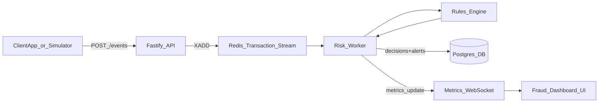

## Finguard – Real‑time Fraud Engine Demo

Finguard is a **small but realistic fraud / risk engine** that processes payment events in near real time, applies multiple fraud rules, and produces **APPROVED / REVIEW / DECLINED** decisions with live monitoring. It is designed as a **portfolio project** to show understanding of:

- **Backend architecture and distributed systems basics**
- **Fraud / risk concepts and trade‑offs**
- **Full‑stack thinking with a live dashboard**

The goal is not to recreate Google Pay or Razorpay, but to demonstrate the same **ideas and patterns** they use on a smaller, easy‑to‑understand scale.

---

## High‑level architecture

At a glance:

- **Fastify API** receives transaction events and exposes read APIs for the dashboard.
- **Redis Streams** buffer incoming events and support consumer groups.
- A **risk worker** consumes events, runs a **rule engine**, and writes decisions.
- **Postgres** stores rule configuration, fraud alerts, and transaction decisions.
- A **WebSocket metrics feed** pushes live metrics to the Angular dashboard.



---

## How the risk engine works

- Incoming events are written to a Redis stream.
- The `transactionWorker`:
  - Ensures **idempotency** using a `processed_transactions` table.
  - Runs each rule in `fraudRules` (e.g. velocity, high amount, rapid failures, suspicious hours, merchant velocity).
  - Each rule returns `{ ruleType, triggered, severity }`.
  - The worker **sums severities** into a `riskScore` and maps it to:
    - `APPROVED`
    - `REVIEW`
    - `DECLINED`
  - The decision and risk score are stored in `transaction_decisions`.
- When a rule fires, it also records or updates an entry in `fraud_alerts`, so the UI can show **which patterns are being detected**.
- The worker maintains **counters and metrics** and pushes WebSocket updates to the dashboard so you can see changes live.

Rule configuration (thresholds, time windows, severities) is stored in a `rule_config` table. The Fastify app listens to a Postgres notification channel and **hot‑reloads rule config** without a deploy.

---

## Current rule set (examples)

Each rule is implemented as a TypeScript file under `backend/src/rules` and conforms to a common `FraudRule` interface.

- **`VELOCITY_V1`** – Too many transactions on the same card in a short time window (Redis counter).
- **`HIGH_AMOUNT_V1`** – Amount greater than a configurable threshold.
- **`RAPID_FAILURE_V1`** – Many failed attempts on the same card in a short window (often card‑testing or bots).
- **`SUSPICIOUS_HOURS_V1`** – Transactions in a configured “risky” time window in Indian Standard Time (e.g. 2–5 AM IST).
- **`MERCHANT_VELOCITY_V1`** – Elevated transaction velocity for a merchant in a short window, which can indicate a compromised merchant or abuse spike.

Each rule:

- Reads its configuration from `app.ruleConfig[<RULE_TYPE>]`.
- Uses cheap in‑memory checks and Redis where possible.
- Optionally writes an aggregated record into `fraud_alerts` for the dashboard.

The combination of rules produces a richer **risk signal** without needing ML on day one.

---

## Resilience and reliability features

The project intentionally demonstrates several patterns that real payment engines use:

- **Idempotency**: `processed_transactions` prevents double‑processing the same transaction ID.
- **Retries with backoff**: transient errors are retried up to a max count, tracked in Redis.
- **Dead‑letter queue (DLQ)**: after too many retries, the event is moved to a DLQ stream for later inspection.
- **Pending message recovery**: on worker restart, `xautoclaim` reclaims stuck messages from other consumers.
- **Hot‑reloaded rule config**: rule parameters live in Postgres and are reloaded via LISTEN/NOTIFY.
- **WebSocket metrics**: the worker pushes live metrics to any connected dashboard clients.

These are exactly the kinds of details senior engineers and SREs look for.

---

## Frontend dashboard (Angular)

The Angular app focuses on **observability and explainability**:

- **Dashboard page** – live metrics via WebSocket:
  - Count of `APPROVED`, `REVIEW`, `DECLINED` decisions.
  - Worker errors, retries, DLQ size.
- **Transactions page** – paginated list of recent decisions from `transaction_decisions`.
- **Fraud alerts page** – aggregated alerts from `fraud_alerts` grouped by rule.
- **Rules page** – view and (optionally) edit rule configuration stored in the `rule_config` table.
- **DLQ page** – inspect messages that failed processing too many times.

This turns the backend into a **product**, not just a service.

---

## How this compares to big‑company fraud engines

This project deliberately implements a **subset** of what large players use:

- ✅ Event‑driven processing (streams + worker) – similar pattern to Kafka / PubSub pipelines.
- ✅ Rule engine with configurable thresholds and severities.
- ✅ Idempotency, retries, DLQ – core reliability concepts.
- ✅ Live metrics and a basic fraud dashboard.
- ✅ Clear, explainable decisions based on explicit rules.

What big payment companies add on top:

- Multiple services and regions for scale and high availability.
- **ML models and graph features** in addition to rules.
- Rich **feature stores** (device, network, behavior, merchant risk).
- Full **case management systems** and non‑engineer rule editing UIs.
- Hard latency SLOs and extensive load testing.

The README explicitly calls this out so reviewers see that you understand both **what you built** and **what a production system would require**.

---

## Running the project

### Prerequisites

- Node.js (LTS)
- Redis
- Postgres

### Backend

From the repository root:

```bash
cd backend
npm install
npm run dev
```

The Fastify server will start, connect to Redis and Postgres, and start the transaction worker.

### Frontend

```bash
cd frontend
npm install
npm run dev   # or: ng serve, depending on your setup
```

Then open `http://localhost:4200/` to view the dashboard.

---

## Demo script for interviews

You can use this as a 3–5 minute walkthrough with a recruiter or senior engineer:

- **1) Problem framing** – “Payments need to catch fraud in milliseconds while avoiding false positives. I built Finguard to explore that trade‑off with an event‑driven design and a set of fraud rules.”
- **2) Architecture** – Show the diagram from this README and briefly explain Redis Streams, the worker, rules, Postgres, and the WebSocket metrics.
- **3) Live demo** – Trigger a few test events:
  - A normal small transaction that gets APPROVED.
  - A high amount or high‑velocity sequence that hits REVIEW/DECLINED.
  - Show the metrics and fraud alerts updating live.
- **4) Comparison** – End with how this maps to real systems and what you would add next (feature store, ML model, more advanced rules) if you were building this for production.

This combination of **working code, clear architecture, and narrative** is what makes the project stand out.

